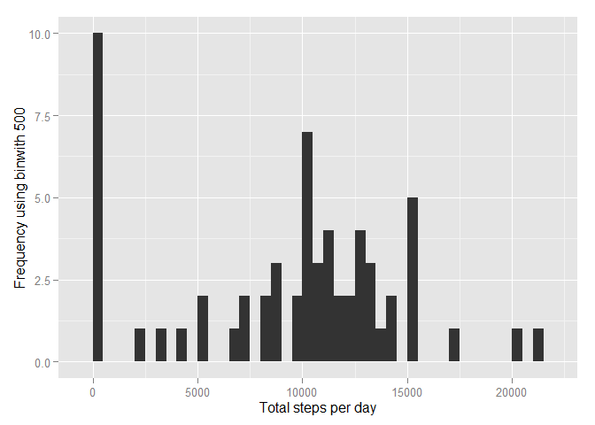

# Reproducible Research: Peer Assessment 1


## Loading and preprocessing the data

```r
file <- read.csv("activity.csv")
library(ggplot2)
```


## What is mean total number of steps taken per day?

```r
stepsByDay <- tapply(file$steps, file$date, sum, na.rm=TRUE)
qplot(stepsByDay, xlab='Total steps per day', ylab='Frequency using binwith 500', binwidth=500)
```

 

```r
stepsByDayMean <- mean(stepsByDay)
stepsByDayMedian <- median(stepsByDay)
```

## What is the average daily activity pattern?

```r
averageStepsPerTimeBlock <- aggregate(x=list(meanSteps=file$steps), by=list(interval=file$interval), FUN=mean, na.rm=TRUE)
ggplot(data=averageStepsPerTimeBlock, aes(x=interval, y=meanSteps)) +
    geom_line() +
    xlab("5-minute interval") +
    ylab("average number of steps taken")
```

 

```r
mostSteps <- which.max(averageStepsPerTimeBlock$meanSteps)
timeMostSteps <-  gsub("([0-9]{1,2})([0-9]{2})", "\\1:\\2", averageStepsPerTimeBlock[mostSteps,'interval'])
print(timeMostSteps)
```

```
## [1] "8:35"
```
## Imputing missing values

```r
sum(is.na(file$steps))
```

```
## [1] 2304
```

```r
newfile <- file
tempvar <- mean(newfile$steps,nana.rm = TRUE)
newfile$steps <- ifelse (is.na(newfile$steps) == TRUE , tempvar, file$steps)
stepsByDayImputed <- tapply(newfile$steps, newfile$date, sum)
qplot(stepsByDayImputed, xlab='Total steps per day (Imputed)', ylab='Frequency using binwith 500', binwidth=500)
```

 

```r
stepsByDayMeanImputed <- mean(stepsByDayImputed)
stepsByDayMedianImputed <- median(stepsByDayImputed)
```
## Are there differences in activity patterns between weekdays and weekends?

```r
newfile$dateType <-  ifelse(as.POSIXlt(newfile$date)$wday %in% c(0,6), 'weekend', 'weekday')
averagedActivityDataImputed <- aggregate(steps ~ interval + dateType, data=newfile, mean)
ggplot(averagedActivityDataImputed, aes(interval, steps)) + geom_line() + facet_grid(dateType ~ .) + xlab("5-minute interval") + ylab("avarage number of steps")
```

 

